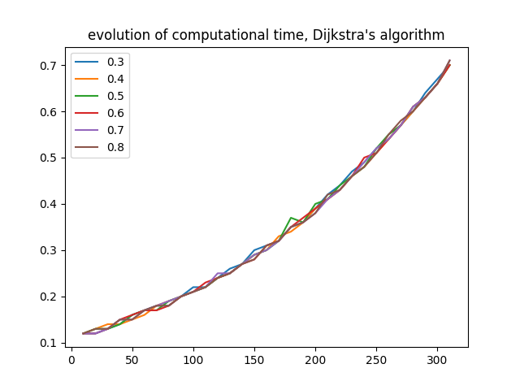
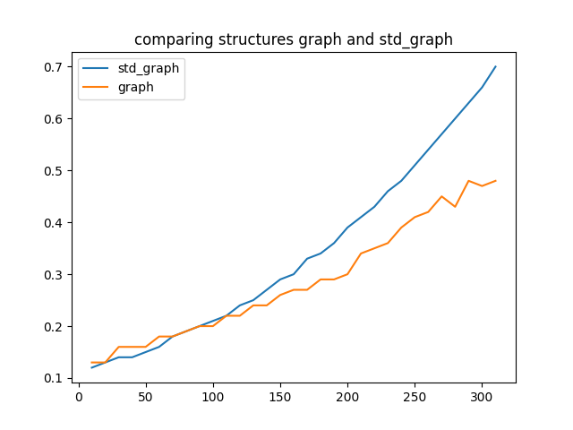
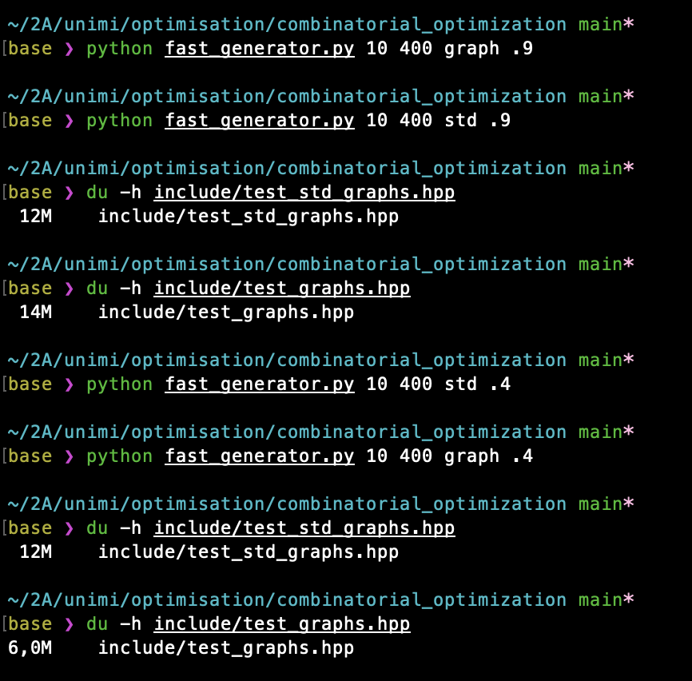

# combinatorial_optimization

School project for the class "Combinatorial Optimization" at the University of Milan.

## Goal

Implementing Dijkstra's algorithm on different data structures so as to compare experimental complexity. Thus, it will be compared to theoretical complexity.

### Random Graphs generator

To best test the algorithm's implementation, it will run on lots of graphs, randomly generated. Speed doesn't matter as much for these graphs, so they'll be computed in `Python`, using `numpy`.

On Unix: To compute `n` graphs of `m` nodes, type:

	python fast_generators n m graph

	python fast_generators n m std

The graphs will be stored in the file `include/test_graphs.hpp` and `include/test_std_graphs.hpp`, directly readable `C++` code. 

For now, the algorithm runs on these two data structures. Fibonacci heap support is in the books.

### Running Dijkstra

Once random graphs are generated, run:

	make

And finally

	./project a b

Will output the result of running Dijkstra on graph n°`a` starting from vertex `b`. Make sure that `a<n` and `b<m`.

Here is an example of graph generator use:

Less than 2 seconds for creating a file with 50 instances of graphs composed of 200 nodes.

## ToDo

Implement other algorithms as well as dijkstra's to enrich the project.

### Results

#### Structure `graph`

Here is the evolution of computational time for Dijkstra's on the structure "Graph":

Run on graphs of 10 to 400 nodes, at a given density.

And with different densities of arcs:

#### Strcture `std_graph`

It can be compared to the results obtained with `graph`:

It can be seen that `std_graph` tends to be slower as the number of nodes (and hence arcs) increases. That's probably due to the fact that the algorithm is very similar, but the data structure is larger when the density is big.

Indeed, let's compare the size of the files containing `graph` and `std_graph` at two different densities:

As expected, the files are very similar when the density is high. `std_graph` always has the same size and is hence more relevant for __high densities__. On the contrary, when the density is low, `std_graph` contains lots of zeros, whereas `graph` only keeps the __relevant__ information. That's why `std_graph` takes up twice as much space on low densities.
