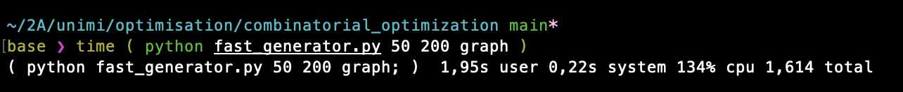

# combinatorial_optimization

School project for the class "Combinatorial Optimization" at the University of Milan.

## Goal

Implementing Dijkstra's algorithm on different data structures so as to compare experimental complexity. Thus, it will be compared to theoretical complexity.

### Random Graphs generator

To best test the algorithm's implementation, it will run on lots of graphs, randomly generated. Speed doesn't matter as much for these graphs, so they'll be computed in `Python`, using `numpy`.

On Unix: To compute `n` graphs of `m` nodes, type:

	python fast_generators n m graph

The graphs will be stored in the file `include/test_graphs.hpp`, directly readable `C++` code. Then, run

It can also creates files for other data structures (`std_graph` and `fibo` (fibonnaci Heaps)). Though Dijkstra has not yet been implemented for these structures ... stay tuned 😊.

### Running Dijkstra

Once random graphs are generated, run:

	make

And finally

	./main a b

Will output the result of running Dijkstra on graph n°`a` starting from vertex `b`. Make sure that `a<n` and `b<m`.

Here is an example of graph generator use:

Less than 2 seconds for creating a file with 50 instances of graphs composed of 200 nodes.
